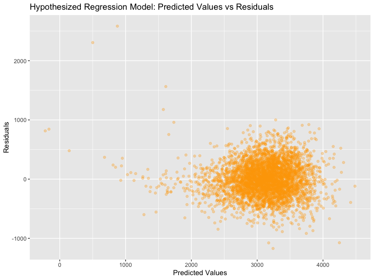
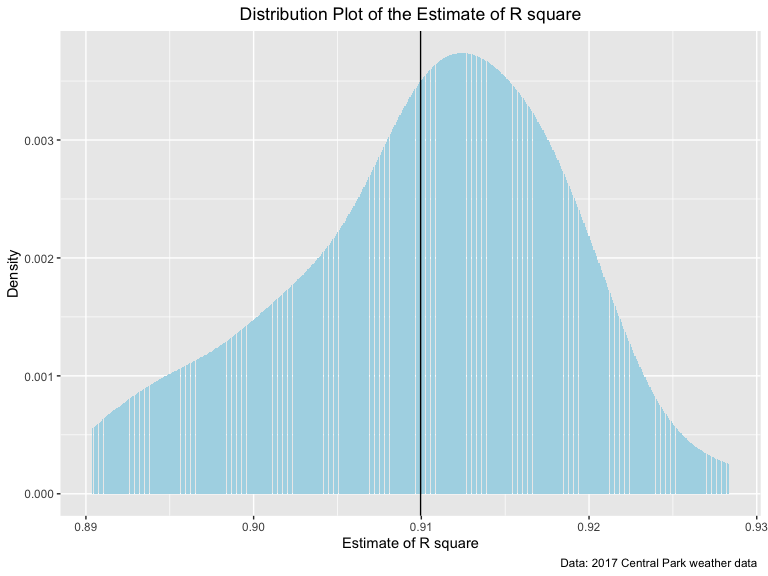

hw6
================
Keyi Wang
11/20/2019

# Problem 1-part1

Load and clean the data for regression analysis (i.e. convert numeric to
factor where appropriate, check for missing data, etc.)

``` r
birthweight = 
  read_csv("./data/birthweight.csv") %>% 
  janitor::clean_names()  %>%
   mutate(
    babysex = as.factor(case_when(
       babysex == 1 ~ "male",
       babysex == 2 ~ "female",
    )),
    frace = as.factor(case_when(
      frace == 1 ~ "White",
      frace == 2 ~ "Black",
      frace == 3 ~ "Asian",
      frace == 4 ~ "Puerto Rican",
      frace == 8 ~ "Other",
      frace == 9 ~ "Unknown",
    )),
    malform = as.factor(case_when(
      malform == 0 ~ "absent",
      malform == 1 ~ "present"
    )),
    mrace = as.factor(case_when(
      mrace == 1 ~ "White",
      mrace == 2 ~ "Black",
      mrace == 3 ~ "Asian",
      mrace == 4 ~ "Puerto Rican",
      mrace == 8 ~ "Other",
    ))
  )
```

    ## Parsed with column specification:
    ## cols(
    ##   .default = col_double()
    ## )

    ## See spec(...) for full column specifications.

``` r
## check for missing data
colMeans(is.na(birthweight)) %>% 
  knitr::kable()
```

|            |                         x |
| ---------- | ------------------------: |
| babysex    |                         0 |
| bhead      |                         0 |
| blength    |                         0 |
| bwt        |                         0 |
| delwt      |                         0 |
| fincome    |                         0 |
| frace      |                         0 |
| gaweeks    |                         0 |
| malform    |                         0 |
| menarche   |                         0 |
| mheight    |                         0 |
| momage     |                         0 |
| mrace      |                         0 |
| parity     |                         0 |
| pnumlbw    |                         0 |
| pnumsga    |                         0 |
| ppbmi      |                         0 |
| ppwt       |                         0 |
| smoken     |                         0 |
| wtgain     |                         0 |
| Therefore, | there is no missing data. |

Propose a regression model for birthweight. This model may be based on a
hypothesized structure for the factors that underly birthweight, on a
data-driven model-building process, or a combination of the two.
Describe your modeling process and show a plot of model residuals
against fitted values – use add\_predictions and add\_residuals in
making this plot.

``` r
hypo_model = function(df) {
  lm(bwt ~ bhead + blength + delwt + menarche , data = df)
}

weight_model = hypo_model(birthweight)

  
birthweight %>% 
  add_predictions(weight_model) %>% 
  add_residuals(weight_model) %>% 
  ggplot(aes(x = pred, y = resid)) + 
    geom_point(alpha = 0.3,color = "orange") +
  labs(
        title = "Hypothesized Regression Model: Predicted Values vs Residuals",
        x = "Predicted Values",
        y = "Residuals"
      )
```


Since we want to build a model based on baby birthweight, I decided to
choose several predictors that are quite relavent to baby birthweight,
which are baby’s head circumference at birth, baby’s length, mother’s
weight at delivery and mother’s age at birth. As we can see in the above
graph, there is a heavy cluster in the lower right corner, with a tail
fanning out to the top left, which suggests that my model is not great.
The residuals do not form a desired straight line across the range of
the predicted values

# part 2

Compare your model to two others: One using length at birth and
gestational age as predictors (main effects only) One using head
circumference, length, sex, and all interactions (including the
three-way interaction) between these Make this comparison in terms of
the cross-validated prediction error; use crossv\_mc and functions in
purrr as appropriate.

``` r
model_1 = function(df) {
  lm(bwt ~ blength + gaweeks, data = birthweight )
}

model_2 = function(df) {
  lm(bwt ~ bhead + blength + babysex +
       (bhead * blength) + (bhead * babysex) + (blength * babysex) +
       (bhead * blength * babysex), data = birthweight)
}


## cross validation, split data and run three models on each split

cv_birthweight = 
  crossv_mc(birthweight, 100) 

cv_birthweight = 
  cv_birthweight %>% 
  mutate(hypo_model = map(train, hypo_model),
         model_1 = map(train, model_1),
         model_2 = map(train, model_2)) %>% 
  mutate(rmse_hypo_model = map2_dbl(hypo_model, test, ~rmse(model = .x, data = .y)),
         rmse_model_1 = map2_dbl(model_1, test, ~rmse(model = .x, data = .y)),
         rmse_model_2 = map2_dbl(model_2, test, ~rmse(model = .x, data = .y)))

## plot for visualization
cv_birthweight %>% 
  select(starts_with("rmse")) %>% 
  gather(key = model, value = rmse) %>% 
  mutate(model = str_replace(model, "rmse_", ""),
         model = recode(model, hypo_model = "Hypothesized Model", model_1 = "Model with no Interaction",
                        model_2 = "Model with Interaction"), 
         model = fct_inorder(model)) %>% 
  ggplot(aes(x = model, y = rmse, fill = model)) + 
  geom_violin() +
  labs(
        title = "Violin Plot Comparing Three Models",
        x = "Model",
        y = "RMSE"
      ) +
    viridis::scale_color_viridis(
      discrete = TRUE
    )
```


Comments: When comparing the my own hypothesized, model 1 and the
interaction models, I noticed that both the hypothesized model and model
with interaction show relative smaller RMSE compared to the model 2.
Model 2 has the highest RMSEs, suggesting a lot of modifications should
be done to improve this model.

# problem 2

``` r
# loading data
weather_df = 
  rnoaa::meteo_pull_monitors(
    c("USW00094728"),
    var = c("PRCP", "TMIN", "TMAX"), 
    date_min = "2017-01-01",
    date_max = "2017-12-31") %>%
  mutate(
    name = recode(id, USW00094728 = "CentralPark_NY"),
    tmin = tmin / 10,
    tmax = tmax / 10) %>%
  select(name, id, everything())
```

    ## Registered S3 method overwritten by 'crul':
    ##   method                 from
    ##   as.character.form_file httr

    ## Registered S3 method overwritten by 'hoardr':
    ##   method           from
    ##   print.cache_info httr

    ## file path:          /Users/wangkeyi/Library/Caches/rnoaa/ghcnd/USW00094728.dly

    ## file last updated:  2019-11-21 19:42:47

    ## file min/max dates: 1869-01-01 / 2019-11-30

``` r
bootstrap_samples = 
  weather_df %>% 
  modelr::bootstrap(n = 50) %>% 
  mutate(
    models = map(strap, ~ lm(tmax ~ tmin, data = .x)),
    results = map(models, broom::tidy),
    variables = map(models, broom::glance)
    ) %>% 
  select(-strap, -models) %>% 
  unnest(results, variables)


# we use the bootstrap samples to make plot on r2
# make plot and display
bootstrap_samples %>% 
  filter(term == "tmin") %>% 
  ggplot(aes(x = r.squared)) + 
  geom_histogram(aes(y = stat(count / sum(count))), stat = "density", fill = "lightblue") +
  labs(
    title = "Distribution Plot of the Estimate of R square",
    x = "Estimate of R square",
    y = "Density",
    caption = "Data: 2017 Central Park weather data ") +
  geom_vline(aes(xintercept = mean(r.squared))) +
  theme(plot.title = element_text(hjust = 0.5))
```


