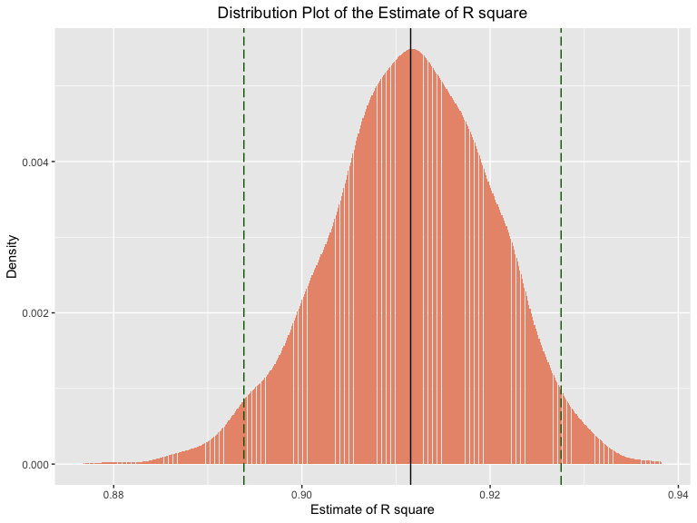
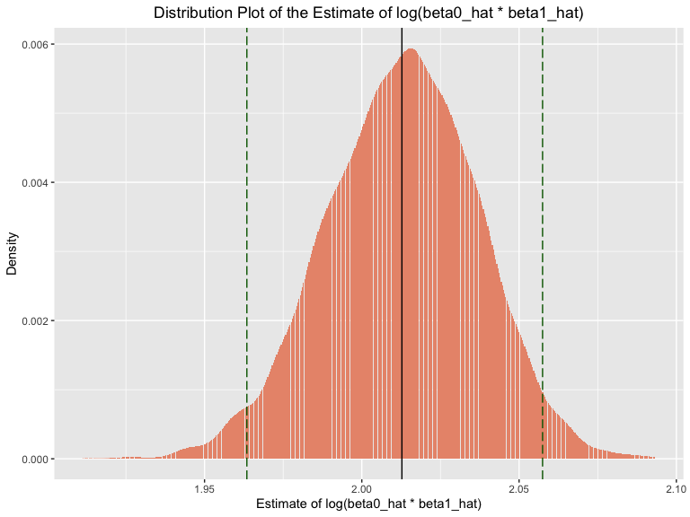

hw6
================
Keyi Wang
11/20/2019

# Problem 1-part1

Load and clean the data for regression analysis (i.e. convert numeric to
factor where appropriate, check for missing data, etc.)

``` r
birthweight = 
  read_csv("./data/birthweight.csv") %>% 
  janitor::clean_names()  %>%
   mutate(
    babysex = as.factor(case_when(
       babysex == 1 ~ "male",
       babysex == 2 ~ "female",
    )),
    frace = as.factor(case_when(
      frace == 1 ~ "White",
      frace == 2 ~ "Black",
      frace == 3 ~ "Asian",
      frace == 4 ~ "Puerto Rican",
      frace == 8 ~ "Other",
      frace == 9 ~ "Unknown",
    )),
    malform = as.factor(case_when(
      malform == 0 ~ "absent",
      malform == 1 ~ "present"
    )),
    mrace = as.factor(case_when(
      mrace == 1 ~ "White",
      mrace == 2 ~ "Black",
      mrace == 3 ~ "Asian",
      mrace == 4 ~ "Puerto Rican",
      mrace == 8 ~ "Other",
    ))
  )
```

    ## Parsed with column specification:
    ## cols(
    ##   .default = col_double()
    ## )

    ## See spec(...) for full column specifications.

``` r
## check for missing data
colMeans(is.na(birthweight)) %>% 
  knitr::kable()
```

|          | x |
| -------- | -: |
| babysex  | 0 |
| bhead    | 0 |
| blength  | 0 |
| bwt      | 0 |
| delwt    | 0 |
| fincome  | 0 |
| frace    | 0 |
| gaweeks  | 0 |
| malform  | 0 |
| menarche | 0 |
| mheight  | 0 |
| momage   | 0 |
| mrace    | 0 |
| parity   | 0 |
| pnumlbw  | 0 |
| pnumsga  | 0 |
| ppbmi    | 0 |
| ppwt     | 0 |
| smoken   | 0 |
| wtgain   | 0 |

Therefore, there is no missing data.

Propose a regression model for birthweight. This model may be based on a
hypothesized structure for the factors that underly birthweight, on a
data-driven model-building process, or a combination of the two.
Describe your modeling process and show a plot of model residuals
against fitted values – use add\_predictions and add\_residuals in
making this plot.

``` r
full = lm(bwt ~ ., data = birthweight)
summary(full)
```

    ## 
    ## Call:
    ## lm(formula = bwt ~ ., data = birthweight)
    ## 
    ## Residuals:
    ##      Min       1Q   Median       3Q      Max 
    ## -1097.68  -184.86    -3.33   173.09  2344.15 
    ## 
    ## Coefficients: (3 not defined because of singularities)
    ##                     Estimate Std. Error t value Pr(>|t|)    
    ## (Intercept)       -6306.8346   659.2640  -9.566  < 2e-16 ***
    ## babysexmale         -28.7073     8.4652  -3.391 0.000702 ***
    ## bhead               130.7781     3.4523  37.881  < 2e-16 ***
    ## blength              74.9536     2.0217  37.075  < 2e-16 ***
    ## delwt                 4.1007     0.3948  10.386  < 2e-16 ***
    ## fincome               0.2898     0.1795   1.614 0.106551    
    ## fraceBlack           -6.9048    78.8349  -0.088 0.930210    
    ## fraceOther          -16.9392    97.5932  -0.174 0.862212    
    ## fracePuerto Rican   -68.2323    78.4692  -0.870 0.384599    
    ## fraceWhite          -21.2361    69.2960  -0.306 0.759273    
    ## gaweeks              11.5494     1.4654   7.882 4.06e-15 ***
    ## malformpresent        9.7650    70.6259   0.138 0.890039    
    ## menarche             -3.5508     2.8951  -1.226 0.220083    
    ## mheight               9.7874    10.3116   0.949 0.342588    
    ## momage                0.7593     1.2221   0.621 0.534418    
    ## mraceBlack          -60.0488    80.9532  -0.742 0.458266    
    ## mracePuerto Rican    34.9079    80.9481   0.431 0.666317    
    ## mraceWhite           91.3866    71.9190   1.271 0.203908    
    ## parity               95.5411    40.4793   2.360 0.018307 *  
    ## pnumlbw                   NA         NA      NA       NA    
    ## pnumsga                   NA         NA      NA       NA    
    ## ppbmi                 4.3538    14.8913   0.292 0.770017    
    ## ppwt                 -3.4716     2.6121  -1.329 0.183913    
    ## smoken               -4.8544     0.5871  -8.269  < 2e-16 ***
    ## wtgain                    NA         NA      NA       NA    
    ## ---
    ## Signif. codes:  0 '***' 0.001 '**' 0.01 '*' 0.05 '.' 0.1 ' ' 1
    ## 
    ## Residual standard error: 272.5 on 4320 degrees of freedom
    ## Multiple R-squared:  0.7183, Adjusted R-squared:  0.717 
    ## F-statistic: 524.6 on 21 and 4320 DF,  p-value: < 2.2e-16

``` r
hypo_model = function(df) {
  lm(bwt ~ bhead + blength + delwt + menarche , data = birthweight)}

weight_model = hypo_model(birthweight)

  
birthweight %>% 
  add_predictions(weight_model) %>% 
  add_residuals(weight_model) %>% 
  ggplot(aes(x = pred, y = resid)) + 
    geom_point(alpha = 0.3,color = "orange") +
  labs(
        title = "Hypothesized Regression Model: Predicted Values vs Residuals",
        x = "Predicted Values",
        y = "Residuals"
      )
```


Since we want to build a model based on baby birthweight, I decided to
choose several predictors that are quite relavent to baby birthweight,
which are baby’s head circumference at birth, baby’s length, mother’s
weight at delivery and mother’s age at birth. As we can see in the above
graph, there is a heavy cluster in the lower right corner, with a tail
fanning out to the top left, which suggests that my model is not great.
The residuals do not form a desired straight line across the range of
the predicted values

# part 2

Compare your model to two others: One using length at birth and
gestational age as predictors (main effects only) One using head
circumference, length, sex, and all interactions (including the
three-way interaction) between these Make this comparison in terms of
the cross-validated prediction error; use crossv\_mc and functions in
purrr as appropriate.

``` r
## the smaller model
model_1 =lm(bwt ~ blength + gaweeks, data = birthweight )

## model with interactions
model_2 = lm(bwt ~ bhead + blength + babysex +
       (bhead * blength) + (bhead * babysex) + (blength * babysex) +
       (bhead * blength * babysex), data = birthweight)


## cross validation, split data and run three models on each split

cv_birthweight = 
  crossv_mc(birthweight, 100) %>%
  mutate(
    train = map(train, as_tibble),
    test = map(test, as_tibble))%>%
  mutate(hypo_model = map(train, ~lm(bwt ~ babysex + bhead + blength + delwt + gaweeks + parity + smoken, data = .x)),
         model_1  = map(train, ~lm(bwt ~ blength + gaweeks, data = .x)),
         model_2 = map(train, ~lm(bwt ~ bhead + blength + babysex +
       (bhead * blength) + (bhead * babysex) + (blength * babysex) +
       (bhead * blength * babysex), data = .x))) %>% 
  mutate(rmse_proposed = map2_dbl(hypo_model, test, ~rmse(model = .x, data = .y)),
         rmse_main_effect = map2_dbl(model_1, test, ~rmse(model = .x, data = .y)),
         rmse_interaction = map2_dbl(model_2, test, ~rmse(model = .x, data = .y)))


## visualization
cv_birthweight %>% 
  select(starts_with("rmse")) %>% 
  pivot_longer(
    everything(),
    names_to = "model", 
    values_to = "rmse",
    names_prefix = "rmse_") %>% 
  mutate(model = fct_inorder(model)) %>% 
  ggplot(aes(x = model, y = rmse, fill = model)) +
  geom_violin(alpha = 0.5) +
  labs(title = "Violin Plot of RMSE in Different Models",
       x = "Models",
       y = "Root Mean of Square Error") +
  theme(plot.title = element_text(hjust = 0.5))
```


Comments: When comparing the my own hypothesized, model 1 and the
interaction models, I noticed that both the hypothesized model and model
with interaction show relative smaller RMSE compared to the model 2.
Model 2 has the highest RMSEs, suggesting a lot of modifications should
be done to improve this model.

# problem 2

``` r
# loading data
weather_df = 
  rnoaa::meteo_pull_monitors(
    c("USW00094728"),
    var = c("PRCP", "TMIN", "TMAX"), 
    date_min = "2017-01-01",
    date_max = "2017-12-31") %>%
  mutate(
    name = recode(id, USW00094728 = "CentralPark_NY"),
    tmin = tmin / 10,
    tmax = tmax / 10) %>%
  select(name, id, everything())
```

    ## Registered S3 method overwritten by 'crul':
    ##   method                 from
    ##   as.character.form_file httr

    ## Registered S3 method overwritten by 'hoardr':
    ##   method           from
    ##   print.cache_info httr

    ## file path:          /Users/wangkeyi/Library/Caches/rnoaa/ghcnd/USW00094728.dly

    ## file last updated:  2019-11-24 18:18:15

    ## file min/max dates: 1869-01-01 / 2019-11-30

``` r
bootstrap_samples = 
  weather_df %>% 
  modelr::bootstrap(n = 5000) %>% 
  mutate(
    models = map(strap, ~ lm(tmax ~ tmin, data = .x)),
    results = map(models, broom::tidy),
    variables = map(models, broom::glance)
    ) %>% 
  select(-strap, -models) %>% 
  unnest(results, variables)

# calculate the 95% CI of r sqaure
CI_r2 = 
  bootstrap_samples %>% 
  filter(term == "tmin") %>% 
  pull(r.squared) %>% 
  quantile(., c(0.025, 0.975))

CI_r2
```

    ##      2.5%     97.5% 
    ## 0.8938343 0.9275407

Therefore the 95% CI of r^2 is \[0.8938343, 0.9275407\].

``` r
bootstrap_samples %>% 
  filter(term == "tmin") %>% 
  # make plot
  ggplot(aes(x = r.squared)) + 
  geom_histogram(aes(y = stat(count / sum(count))), stat = "density", fill = "lightblue") +
  labs(
    title = "Distribution Plot of the Estimate of R square",
    x = "Estimate of R square",
    y = "Density",
    caption = "Data: 2017 Central Park weather data ") +
  geom_vline(aes(xintercept = mean(r.squared))) +
  geom_vline(aes(xintercept = CI_r2[[1]]), color = "red") +
  geom_vline(aes(xintercept = CI_r2[[2]]), color = "red") +
  theme(plot.title = element_text(hjust = 0.5))
```



According to the plot, we can see that this is close to normal curve. We
can also tell from the CI that most of data were distributed around the
center. Hence, we can say that the estimate is roughly distributed
normally.

``` r
# calculate the 95% CI of log(beta0_hat * beta1_hat)
beta_ci = 
  bootstrap_samples %>% 
  select(.id, term, estimate) %>% 
  pivot_wider(
    id_cols = .id,
    names_from = term,
    values_from = estimate
  ) %>% 
  janitor::clean_names() %>% 
  mutate(log_estimate = log(intercept * tmin)) %>% 
  pull(log_estimate) %>% 
  quantile(., c(0.025, 0.975))

# display
beta_ci
```

    ##     2.5%    97.5% 
    ## 1.963457 2.057467

Therefore the 95% CI of is \[1.9634567, 2.0574665\]

``` r
bootstrap_samples %>% 
  select(.id, term, estimate) %>% 
  pivot_wider(
    id_cols = .id,
    names_from = term,
    values_from = estimate
  ) %>% 
  janitor::clean_names() %>% 
  mutate(log_estimate = log(intercept * tmin)) %>% 
  #make plot
  ggplot(aes(x = log_estimate)) + 
  geom_histogram(aes(y = stat(count / sum(count))), stat = "density", fill = "lightblue") +
  labs(
    title = "Distribution Plot of the Estimate of log(beta0_hat * beta1_hat)",
    x = "Estimate of log(beta0_hat * beta1_hat)",
    y = "Density",
    caption = "Data: 2017 Central Park weather data ") +
  
  geom_vline(aes(xintercept = mean(log_estimate))) +
  geom_vline(aes(xintercept = beta_ci[[1]]), color = "red") +
  geom_vline(aes(xintercept = beta_ci[[2]]), color = "red") +
  theme(plot.title = element_text(hjust = 0.5))
```



comments:According to density plot, we can see that this is close to
normal curve. We can also tell from the CI that most of data were
distributed around the center. Hence, we can say that the estimate
log(beta0\_hat \* beta1\_hat) is roughly distributed normally. This
density plot is not as “normal”/“belled” as r^2’s distribution.
